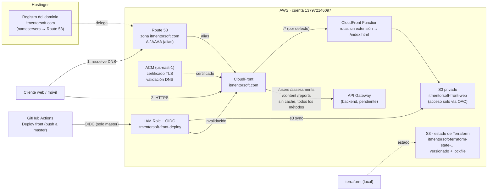

# Infraestructura del front (AWS)

CloudFront + S3 privado + ACM + Route 53. El dominio sigue registrado en Hostinger; solo se delegan los nameservers a Route 53.



Sin `api_origin_domain`, CloudFront solo sirve el front y no enruta el API (la flecha hacia API Gateway aún no está activa).

## Primer despliegue

Requiere credenciales de AWS con permisos para crear estos recursos.

1. Crear solo la zona DNS:
   ```
   cd infra
   terraform init
   terraform apply '-target=aws_route53_zone.main'
   ```
   (Las comillas son necesarias en PowerShell; sin ellas parte el argumento en el punto.)
2. Copiar los 4 valores de `name_servers` (`terraform output name_servers`) en Hostinger:
   Dominios -> itmentorsoft.com -> Administrar -> Servidores de nombres.
   Esperar la propagación (minutos a algunas horas).
3. Crear todo lo demás (la validación del certificado espera a la propagación):
   ```
   terraform apply
   ```
4. Crear en GitHub (Settings -> Secrets and variables -> Actions -> **Variables**) las 4 variables que muestra `terraform output github_variables`:
   `AWS_ROLE_ARN`, `AWS_REGION`, `S3_BUCKET`, `CLOUDFRONT_DISTRIBUTION_ID`.
5. Hacer merge a `master`: el workflow `Deploy front` compila, sube a S3 e invalida la caché.

## Conectar el API

Mientras `api_origin_domain` esté vacío, CloudFront solo sirve el front. Cuando exista el API Gateway:

```
terraform apply -var 'api_origin_domain=abc123.execute-api.us-east-1.amazonaws.com'
```

Si el API Gateway usa un stage con nombre (ej. `/prod`), agregar `-var 'api_origin_path=/prod'`.

## Notas

- `create_github_oidc_provider`: AWS permite un solo proveedor OIDC de GitHub por cuenta. Si ya existe, usar `-var create_github_oidc_provider=false`.
- El estado de Terraform está en S3 (`itmentorsoft-terraform-state-137972146097`, clave `front/terraform.tfstate`, con versionado y bloqueo nativo). Ese bucket se creó a mano y no lo gestiona este Terraform; no borrarlo. Los archivos `*.tfstate` locales están ignorados por git.
- Las rutas de Angular (sin extensión) se resuelven con una CloudFront Function que sirve `/index.html`. No se usa `custom_error_response` porque afectaría también a los 403/404 del API.
